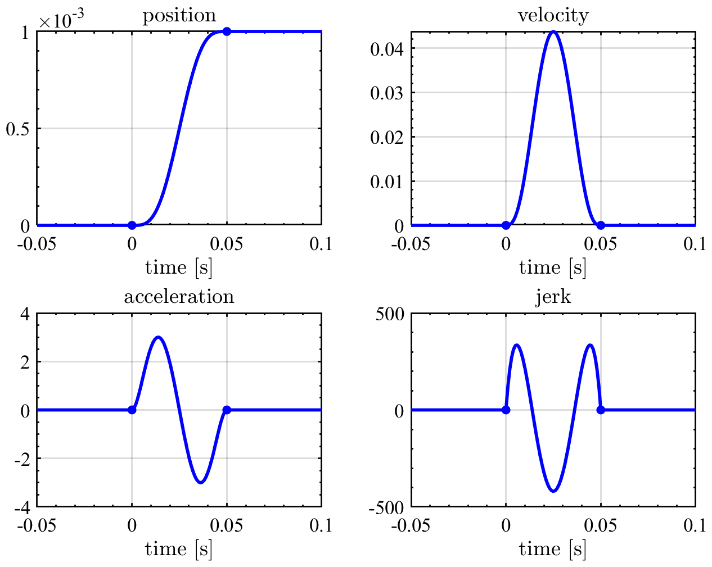
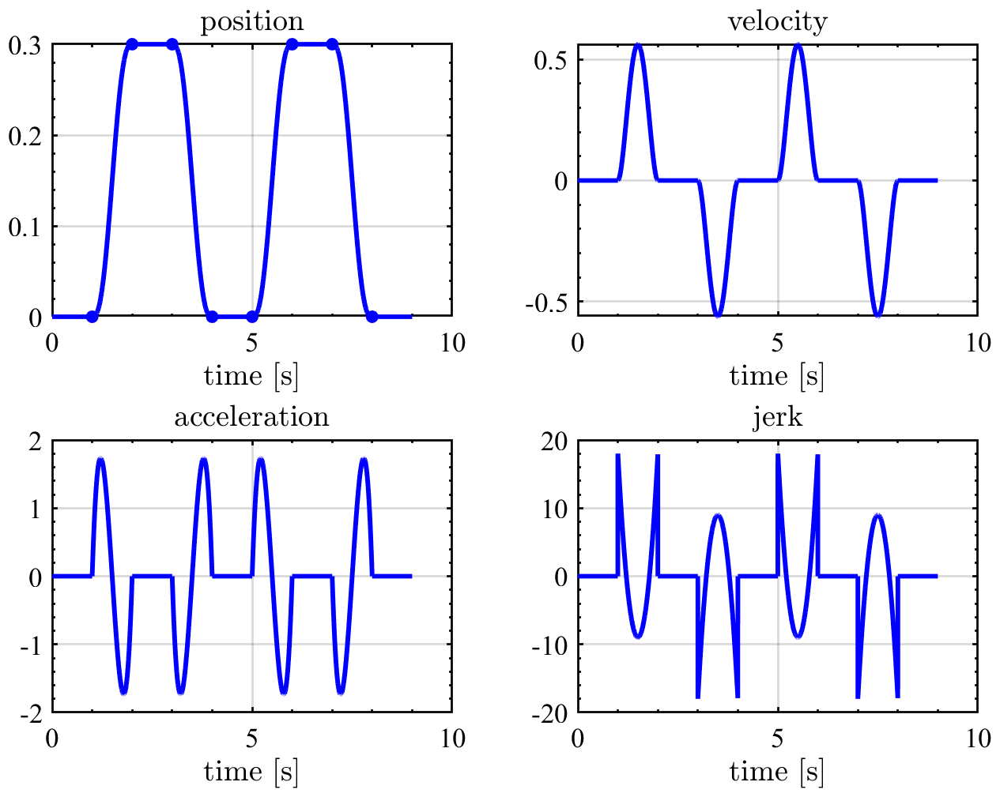
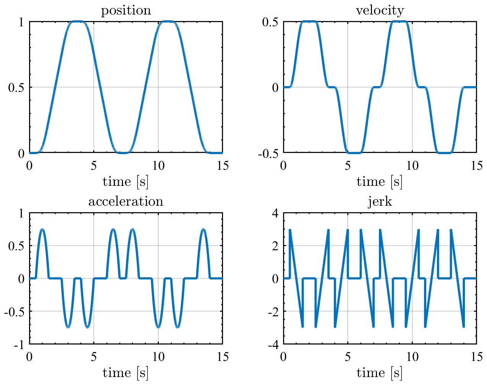
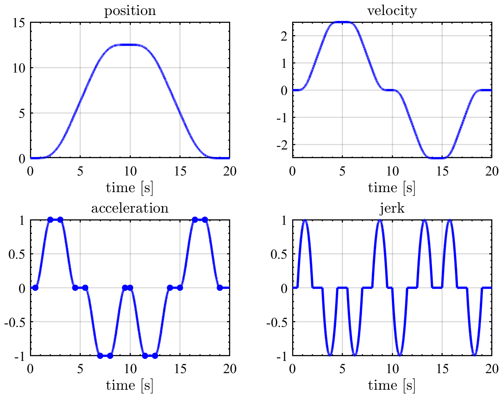

# TrajectTools
Polynomial trajectory generation tools for MATLAB. Analytical differentiation is calculated. 

## Features
* Arbitrary order trajectory
* Analytical differentiation 
No numerical differentiation, no delay
* Symbolic coefficients as well as numerical coefficients

## Installation 
addpath `src` to MATLAB
### Requred toolbox
* Symbolic math toolbox
* Optional: [FigTools](https://github.com/ThomasBeauduin/FigTools)

## Step trajectory
See [example](docs/docs/ex1_step.m)

## Back and forth motion with position constraints
See [example](docs/ex2_backandforth_pos.m)

## Back and forth motion with velocity constraints
See [example](docs/ex3_backandforth_vel.m)

## Back and forth motion with acceleration constraints
See [example](docs/ex4_backandforth_acc.m)

## 3rd order time-optimal trajectory 
See [example](docs/ex5_backandforth_minTime_3rd.m)

[Advanced Setpoints for Motion Systems](https://jp.mathworks.com/matlabcentral/fileexchange/16352-advanced-setpoints-for-motion-systems) is utilized.

## 4rd order time-optimal trajectory 
See [example](docs/ex6_backandforth_minTime_4th.m)

[Advanced Setpoints for Motion Systems](https://jp.mathworks.com/matlabcentral/fileexchange/16352-advanced-setpoints-for-motion-systems) is utilized.

