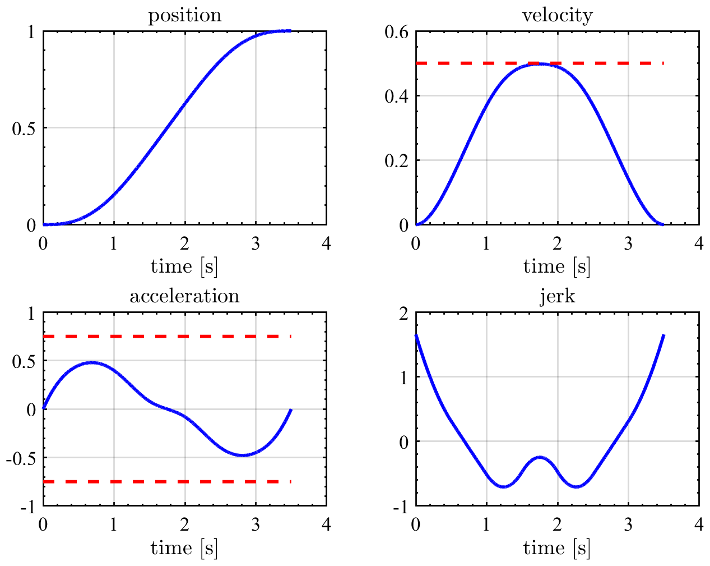
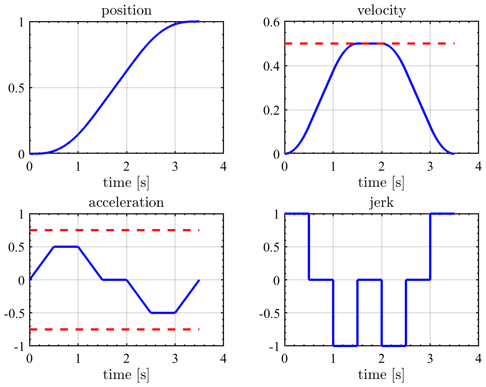
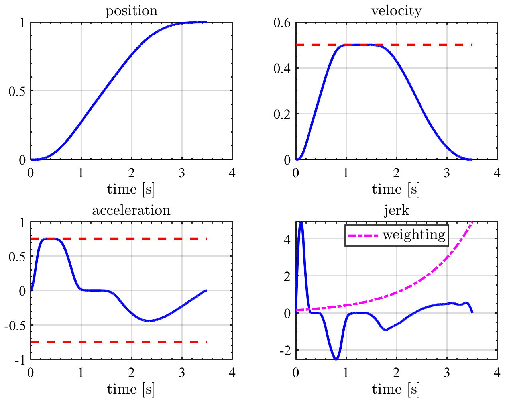
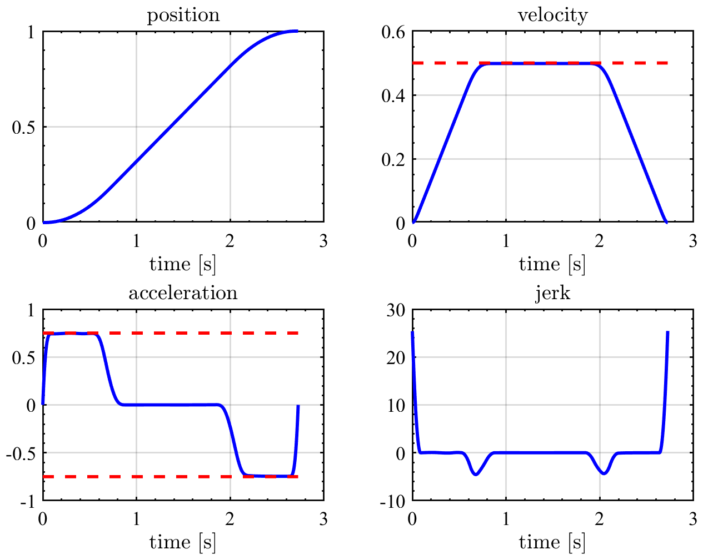

# TrajectTools
Polynomial trajectory generation tools for MATLAB. Analytical differentiation is calculated. 

## Features
* Arbitrary order trajectory
* Analytical differentiation 
No numerical differentiation, no delay
* Symbolic coefficients as well as numerical coefficients

## Installation 
addpath `src` to MATLAB
### Requred toolbox
* Symbolic math toolbox
* Optional: [FigTools](https://github.com/ThomasBeauduin/FigTools)

## Case 1: Position constrained step trajectory
See [example](docs/ex1_pos_step.m)

## Case 2: Position constrained back and forth trajectory
See [example](docs/ex2_pos_backandforth.m)

## Case 3: Velocity constrained back and forth trajectory
See [example](docs/ex3_vel_backandforth.m)

## Case 4: Acceleration constrained back and forth trajectory
See [example](docs/ex4_acc_backandforth.m)

## Case 5: Time-optimal 3rd order trajectory 
### Required additional toolbox
* [Advanced Setpoints for Motion Systems](https://jp.mathworks.com/matlabcentral/fileexchange/16352-advanced-setpoints-for-motion-systems)  
Ref: M. Lambrechts, Paul; Boerlage, M.; Steinbuch, “Trajectory planning and feedforward design for electromechanical motion systems,” Control Eng. Pract., vol. 13, pp. 145–157, 2005.

See [example](docs/ex5_timeOpt_3rd_backandforth.m)

## Case 6: Time-optimal 4th order trajectory 
### Required additional toolbox
* [Advanced Setpoints for Motion Systems](https://jp.mathworks.com/matlabcentral/fileexchange/16352-advanced-setpoints-for-motion-systems) 
Ref: M. Lambrechts, Paul; Boerlage, M.; Steinbuch, “Trajectory planning and feedforward design for electromechanical motion systems,” Control Eng. Pract., vol. 13, pp. 145–157, 2005.

See [example](docs/ex6_timeOpt_4th_backandforth.m)

## Case 7: Jerk-optimal 5th order trajectory 
### Required additional toolbox
* [splines.m](https://gitlab.kuleuven.be/meco/splines-m) 
Ref: W. Van Loock, G. Pipeleers, and J. Swevers, “B-spline parameterized optimal motion trajectories for robotic systems with guaranteed constraint satisfaction,” Mech. Sci., vol. 6, no. 2, pp. 163–171, 2015, doi: 10.5194/ms-6-163-2015.
* [YALMIP](https://yalmip.github.io/) 
Ref: J. Löfberg, “YALMIP : A Toolbox for Modeling and Optimiza- tion in MATLAB,” in Proceedings of the CACSD Conference, Taipei, Taiwan, 2004. 
* Appropriate solver  
e.g. [MOSEK](https://www.mosek.com/), [SeDuMi](http://sedumi.ie.lehigh.edu/?page_id=58)

Jerk 2-norm minimization

See [example](docs/ex7_jerkOpt_backandforth.m)

## Case 8: Jerk-optimal 3rd order trajectory 
### Required additional toolbox
* [splines.m](https://gitlab.kuleuven.be/meco/splines-m) 
Ref: W. Van Loock, G. Pipeleers, and J. Swevers, “B-spline parameterized optimal motion trajectories for robotic systems with guaranteed constraint satisfaction,” Mech. Sci., vol. 6, no. 2, pp. 163–171, 2015, doi: 10.5194/ms-6-163-2015.
* [YALMIP](https://yalmip.github.io/) 
Ref: J. Löfberg, “YALMIP : A Toolbox for Modeling and Optimiza- tion in MATLAB,” in Proceedings of the CACSD Conference, Taipei, Taiwan, 2004. 
* Appropriate solver  
e.g. [MOSEK](https://www.mosek.com/), [SeDuMi](http://sedumi.ie.lehigh.edu/?page_id=58)

Jerk infinity-norm minimization

See [example](docs/ex8_jerkOpt_minInfNorm_backandforth.m)

## Case 9: Jerk-optimal 5th order trajectory 
### Required additional toolbox
* [splines.m](https://gitlab.kuleuven.be/meco/splines-m) 
Ref: W. Van Loock, G. Pipeleers, and J. Swevers, “B-spline parameterized optimal motion trajectories for robotic systems with guaranteed constraint satisfaction,” Mech. Sci., vol. 6, no. 2, pp. 163–171, 2015, doi: 10.5194/ms-6-163-2015.
* [YALMIP](https://yalmip.github.io/) 
Ref: J. Löfberg, “YALMIP : A Toolbox for Modeling and Optimiza- tion in MATLAB,” in Proceedings of the CACSD Conference, Taipei, Taiwan, 2004. 
* Appropriate solver  
e.g. [MOSEK](https://www.mosek.com/), [SeDuMi](http://sedumi.ie.lehigh.edu/?page_id=58)

Weighted jerk 2-norm minimization

See [example](docs/ex9_jerkOpt_Weight_backandforth.m)

## Case 10: Time-optimal 5th order trajectory 
### Required additional toolbox
* [splines.m](https://gitlab.kuleuven.be/meco/splines-m) 
Ref: W. Van Loock, G. Pipeleers, and J. Swevers, “B-spline parameterized optimal motion trajectories for robotic systems with guaranteed constraint satisfaction,” Mech. Sci., vol. 6, no. 2, pp. 163–171, 2015, doi: 10.5194/ms-6-163-2015.
* [YALMIP](https://yalmip.github.io/) 
Ref: J. Löfberg, “YALMIP : A Toolbox for Modeling and Optimiza- tion in MATLAB,” in Proceedings of the CACSD Conference, Taipei, Taiwan, 2004. 
* Appropriate solver  
e.g. [MOSEK](https://www.mosek.com/), [SeDuMi](http://sedumi.ie.lehigh.edu/?page_id=58)

Time-optimal trajectory. More flexible than Case 6 but numerically sensitive

See [example](docs/ex10_timeOpt_backandforth.m)

